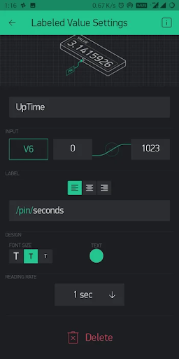

# IoT - Thermometer LM35 Blynk Based On NodeMCU ESP8266 v3 Lolin

- This project demonstrates an IoT thermometer using the LM35 temperature sensor and NodeMCU v3 Lolin, with real-time temperature data displayed on the Blynk platform. The temperature is measured in Celsius and sent to the Blynk app for monitoring.

- The LM35 is a linear analog temperature sensor whose output voltage varies linearly with changes in temperature. The LM35 can measure temperatures from -55 degrees Celsius to +150 degrees Celsius. The voltage output from the LM35 increases by 10 mV for every degree Celsius increase in temperature. If the LM35 sensor is connected to an IoT device, the data obtained can be processed and displayed anywhere.

## Features

- Real-time temperature readings from the LM35 sensor.
- Display temperature data on the Blynk app (virtual pin V5).
- Monitors uptime (virtual pin V6).
- Wi-Fi connectivity for remote temperature monitoring.

# Schematic:

- Below you can see a schematic image to facilitate the wiring of cables from the microcontroller to devices, both input and output sensors:

## Components

- NodeMCU ESP8266 v3 Lolin = 1 unit;
- LM35 Temperature Sensor = 1 unit;
- Breadboard / Project Board = 1 unit;
- Jumper wires.

## Pin Configuration

- **LM35 Sensor**:
  - Vout → A0 NodeMCU
  - Vcc → 3.3V NodeMCU
  - GND → GND NodeMCU

## How It Works

1. **Temperature Reading**: The LM35 sensor provides an analog voltage output based on the temperature, which is read by the NodeMCU on analog pin A0.
2. **Data Transmission**: The temperature value is converted from analog to Celsius and sent to the Blynk platform (virtual pin V5).
3. **Remote Monitoring**: Users can monitor the temperature and uptime through the Blynk app in real time.

## Blynk Setup

1. Install the Blynk app from the app store.
2. Create a new project and configure virtual pins V5 (temperature) and V6 (uptime).
3. Use the authentication token from the Blynk app in the code.

## BLYNK Settings:

- • Use Gauge and Labeled Value type Widget Boxes.
   
  Widget Box selection image 

- • Setting Pin V5 for Gauge temperature
   
  Image of Gauge Settings  

- • Setting Pin V6 for Labeled Value
   
  Image of Labeled Value Settings  

## Interface Apk:

 
Image of Interface Temperature Blynk  

## Code Explanation

- The `ESP8266WiFi` and `BlynkSimpleEsp8266` libraries are used for Wi-Fi and Blynk integration.
- The `BlynkTimer` is used to read the temperature every second and send the data to the Blynk app.
- The uptime is calculated in seconds and displayed on the Blynk app.

## Usage

1. Connect the components as per the pin configuration.
2. Upload the code to your NodeMCU with your Wi-Fi credentials and Blynk token.
3. Monitor temperature and uptime on the Blynk app.

## Conclusion

This project provides an easy way to monitor temperature remotely using the Blynk IoT platform. The LM35 sensor reads the temperature, and the NodeMCU sends the data to the Blynk app for real-time monitoring.
 
"# Thermometer-LM35-BasedOn-IoT-Blynk-and-NodeMCU-v3" 
